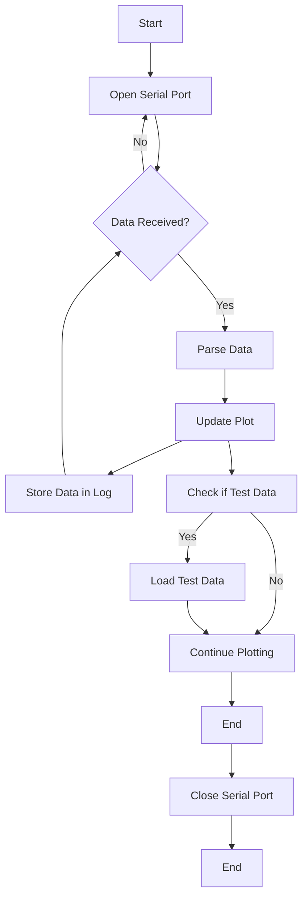

# Data Collector Station (DCS) Plotter

This Python script is designed to receive and plot data from a Data Collector Station (DCS). The received data is expected to be in a Pandas-compatible array format.

## Table of Contents

- [About](#about)
- [Getting Started](#getting-started)
- [Usage](#usage)
- [Dependencies](#dependencies)
- [Contact](#contact)
- [Acknowledgments](#acknowledgments)

## About

This script was created as part of an engineering master's degree thesis at Instituto Balseiro, Argentina, by Andres Oliva Trevisan. It allows you to visualize data received from a DCS on a map. The script can either read data from a real serial port or simulate data for testing purposes.

### Tested Library Versions

- Dash: 2.10.2
- Plotly: 5.14.1

## Getting Started

To use this script, follow these steps:

1. Clone this repository to your local machine.
2. Install the required libraries by running the following commands:

pip install pyserial pandas plotly dash

3. Run the script, which will start a Dash web application.

## Usage

- Select the serial port you want to use from the dropdown menu.
- The script will continuously read data from the selected serial port or simulate data if the "Simulate Serial Port" option is chosen.
- The received data will be displayed on a map with markers indicating various information about the DCS devices.

## Dependencies

- [Dash](https://dash.plotly.com/): A Python web application framework.
- [Plotly](https://plotly.com/): A graphing library for interactive visualizations.
- [PySerial](https://pythonhosted.org/pyserial/): A Python library for serial communication.
- [Pandas](https://pandas.pydata.org/): A data manipulation library.

## Contact

For any questions or inquiries, please contact:

- Email: [olivaandres93@gmail.com](mailto:olivaandres93@gmail.com)
- LinkedIn: [Andres Oliva Trevisan](https://www.linkedin.com/in/andres-oliva-trevisan-833561165/)

## Acknowledgments

Special thanks to the fellow members of the Chelonoidis Chilensis Tortoise Research Team in Argentina who made this possible :

- PhD. Erika Kubisch
- PhD.  Karina Laneri
- PhD. Laila D. Kazimierski
- Eng. Nicolás Catalano
## Flowchart

