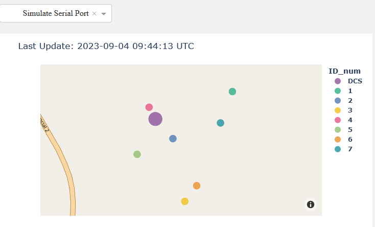
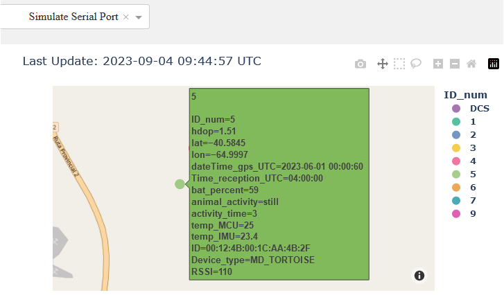
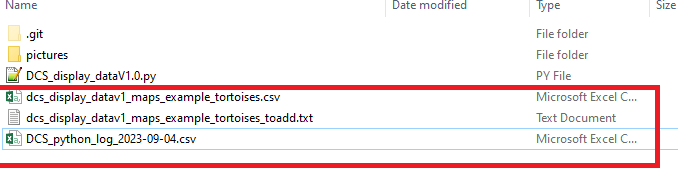
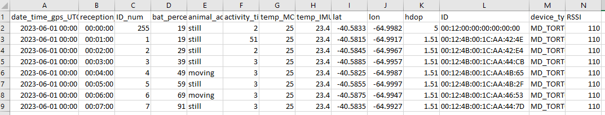
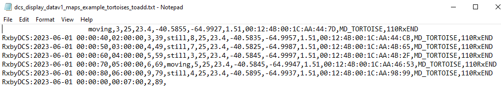
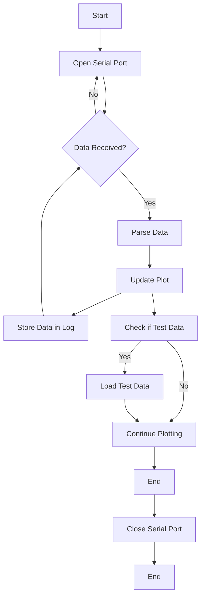

# Data Collector Station (DCS) Plotter

This Python script is designed to receive and plot data into a web site (by creating a local webserver) received through a serial port from a Data Collector Station (DCS) device. The DCS receives the information sent by radio frequency from a Monitoring Device (MD) attached to different tortoises. The received data through the serial port  is expected to be in a Pandas-compatible array format. Then the information received by the script will be stored in a .csv log. This Scripts also allows you to simulate the data received from the serial port, meaning that you do not need to have any device outside a computer to run the script in order to test it. 

For further information regarding the devices utilized (MD and DCS), [check the following repository](https://github.com/TortoisesSAO/CodesDevice): 

### Example of locations displayed
 

### Example of mouser over and data displayed over one of the monitoring devices 

 

## Table of Contents

- [About](#about)
- [Getting Started](#getting-started)
- [Usage](#usage)
- [Dependencies](#dependencies)
- [Contact](#contact)
- [Acknowledgments](#acknowledgments)

## About

This script was created as part of my engineering master's degree thesis at Instituto Balseiro, Argentina. It allows you to visualize data received from a DCS on a plotted map by using Dash and Plotly to create a web server that holds the website in which the plot is created. The script can either read data from a real serial port or simulate data to allow the user to test the script without any external hardware.

### Tested Library Versions

- Dash: 2.10.2
- Plotly: 5.14.1

## Getting Started

To use this script, follow these steps:

1. Clone this repository to your local machine.
2. Install the required libraries by running the following commands:

pip install pyserial pandas plotly dash

3. Run the script, which will start a Dash web application.

## Usage

- Select the serial port you want to use from the dropdown menu.
- The script will continuously read data from the selected serial port or simulate data if the "Simulate Serial Port" option is chosen.
- The received data will be displayed on a map with markers indicating various information about the DCS devices.

#### Serial Data Simulation

When running the script in simulation mode, the simulated data will be read from the following files. If these files do now exist, they will be created by the script automatically.

 

##### Simulated data: Default values

 

##### Simulated data: Serial port simulation

 

## Dependencies

- [Dash](https://dash.plotly.com/): A Python web application framework.
- [Plotly](https://plotly.com/): A graphing library for interactive visualizations.
- [PySerial](https://pythonhosted.org/pyserial/): A Python library for serial communication.
- [Pandas](https://pandas.pydata.org/): A data manipulation library.

## Software Flowchart

The following chart shows in a very simple way how the script works. Keep in mind that the serial data reception happens in a different thread than the one who is making the plots.

## Contact

For any questions or inquiries, please contact:

- Email: [olivaandres93@gmail.com](mailto:olivaandres93@gmail.com)
- LinkedIn: [Andres Oliva Trevisan](https://www.linkedin.com/in/andres-oliva-trevisan-833561165/)

## Acknowledgments

Special thanks to the fellow members of the Chelonoidis Chilensis Tortoise Research Team in Argentina who made this possible :

- PhD. Erika Kubisch
- PhD.  Karina Laneri
- PhD. Laila D. Kazimierski
- Eng. Nicolás Catalano
